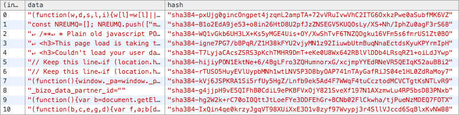
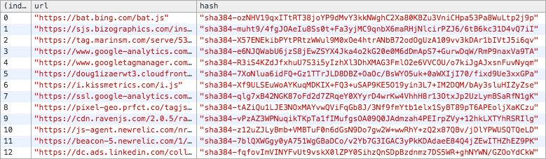

# AutoCSP


AutoCSP is not just another tool to generate a valid Content Security Policy header
for your current webpage. Also is a didactic tool to understand all the
available ways to increase the security of your web page.

With AutoCSP you can generate:

- Content-Security-Policy headers
- Nonce references
- Subresource integrity hashes
- Inline script hashes

### How it works

Basically, it analizes your DOM tags looking for sources for all the rules:

- **default-src:**
- **script-src:**
- **style-src:**
- **img-src:**
- **child-src:**
- **media-src:**
- **object-src:**

Not supported yet:

- **font-src:**
- **connect-src:**

### How to use it

Go to you webpage, open the browser inspector and include the minified version
of this library in your DOM manually.

```html
<script src="http://cdn..../autocsp.min.js"></script>
```

If your are using jQuery in your webpage you can run this:

```javascript
$.getScript("http://cdn..../autocsp.min.js");
```

After load this library in your webpage context, then you can start to analyze
your webpage. Run the code below:

```javascript
AutoCSP.rule();
```
and you will get a console output like this:

```
Content-Security-Policy: default-src 'none'; script-src 'self' www.google-analytics.co www.googletagmanager.co i.kissmetrics.co cdn.ravenjs.co 'sha256-faDewrRjLN6HVr4qFb34mLsJTMWzibMGtolRQsuqEB0=' 'sha256-Dvu64ENYzDEkDpriV+KtNqfahz95IoNI4db+QIp9F+g='; style-src 'self' fonts.googleapis.co; img-src 'self' secure.gravatar.co; child-src 'none'; font-src 'self'; connect-src 'self'; media-src 'none'; object-src 'none';
```

**Note:** It's important to understand that this should not be the common flow to create
this header for your web page. When you start creating a webpage, you need to
control all the orgins where you resquest from, instead of generate them
afterwards. However, for projects that have not controlled their source origins
in the past, this tool could be useful to spot them.

By default, AutoCSP generates all the hashes with `sha256` algorithm but you
can change it to one of the availble ones:

- sha1
- sha256 * Default
- sha384
- sha512

Example:
```javascript
AutoCSP.setup('sha384');
```

CSP Level 2 added backward compatibility for inline scripts by allowing you to
whitelist specific inline scripts using either a cryptographic nonce (number
used once) or a hash. As we said before, with AutoCSP you can get all current
hashes:

```javascript
AutoCSP.hashes();
```


If your are loading third-party JavaScript and you want to prevent unexpected
or malicious modifications, we recomend to you add [Subresource
Integrity](https://hacks.mozilla.org/2015/09/subresource-integrity-in-firefox-43/)
checks to all your script tags.

With this feature you can be sure that your webpage will not be compromised if
one ore more scripts in your Content Delivery Networks (CDNs) get modified
without authorization.

```html
<script src="https://cdnjs.cloudflare.com/ajax/libs/underscore.js/1.8.3/underscore-min.js" integrity="sha384-FZY+KSLVXVyc1qAlqH9oCx1JEOlQh6iXfw3o2n3Iy32qGjXmUPWT9I0Z9e9wxYe3" crossorigin="anonymous"></script>
```

In this example, we are inclouding [Underscore library](http://underscorejs.org/),
from CloudFlare CDN and we can be sure that we are loading the code that we
trust and match with
`sha384-FZY+KSLVXVyc1qAlqH9oCx1JEOlQh6iXfw3o2n3Iy32qGjXmUPWT9I0Z9e9wxYe3` hash.

In AutoCSP you can generate all Subresource Integrity hashes for your third
party scripts all at the same time. Just run:

```javascript
AutoCSP.integrities();
```



### TODO

- Tests
- Detect font-src urls: we need to parse css to retreive them
- Detect connect urls: we need to analyze XHR traffic

### Report a bug

1. Check if the bug is already fixed in the [master branch][master] since the
last release.
2. Check [existing issues][issues]. Open a new one, including exact browser &
platform information. For better formatting of your report, see
[GitHub-flavored Markdown][mkd].

### License

(The MIT License)

Copyright (c) 2016 Ferran Basora <fcsonline@gmail.com>

Permission is hereby granted, free of charge, to any person obtaining a copy of this software and associated documentation files (the 'Software'), to deal in the Software without restriction, including without limitation the rights to use, copy, modify, merge, publish, distribute, sublicense, and/or sell copies of the Software, and to permit persons to whom the Software is furnished to do so, subject to the following conditions:

The above copyright notice and this permission notice shall be included in all copies or substantial portions of the Software.

THE SOFTWARE IS PROVIDED 'AS IS', WITHOUT WARRANTY OF ANY KIND, EXPRESS OR IMPLIED, INCLUDING BUT NOT LIMITED TO THE WARRANTIES OF MERCHANTABILITY, FITNESS FOR A PARTICULAR PURPOSE AND NONINFRINGEMENT. IN NO EVENT SHALL THE AUTHORS OR COPYRIGHT HOLDERS BE LIABLE FOR ANY CLAIM, DAMAGES OR OTHER LIABILITY, WHETHER IN AN ACTION OF CONTRACT, TORT OR OTHERWISE, ARISING FROM, OUT OF OR IN CONNECTION WITH THE SOFTWARE OR THE USE OR OTHER DEALINGS IN THE SOFTWARE.
